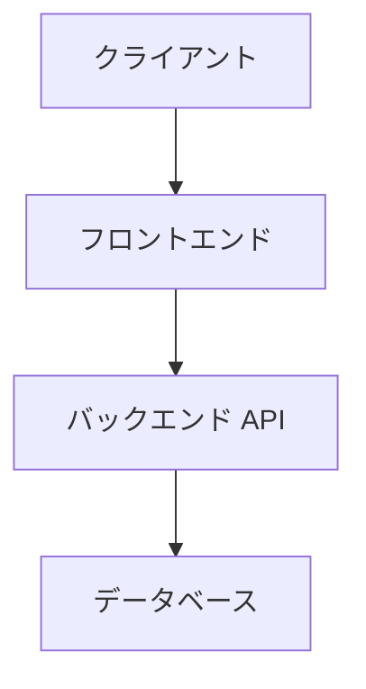

# [リポジトリ名] アーキテクチャ設計書

> **最終更新:** YYYY-MM-DD
> **担当者:** @GitHub-username
> **対象リポジトリ:** [リポジトリ名](https://github.com/shikosai34/リポジトリ名)

---

## 1. 概要

<!-- このリポジトリ・システムが何をするものか、1〜3文で説明してください -->

## 2. システム構成図

<!-- Mermaid や画像で構成図を示してください -->



## 3. 技術スタック

| レイヤー | 技術 | バージョン | 採用理由 |
|:--|:--|:--|:--|
| | | | |

## 4. ディレクトリ構成

```
リポジトリ名/
├── src/
└── ...
```

## 5. 環境変数

| 変数名 | 説明 | 必須 | デフォルト値 |
|:--|:--|:--:|:--|
| | | | |

## 6. 開発環境のセットアップ

```bash
# 手順を記載
```

## 7. デプロイ方法

<!-- 本番環境へのデプロイ手順を記載してください -->

## 8. 依存関係・連携システム

<!-- 他のリポジトリや外部サービスとの連携を記載してください -->

## 9. 注意事項・既知の問題

<!-- 開発・運用上の注意点を記載してください -->
